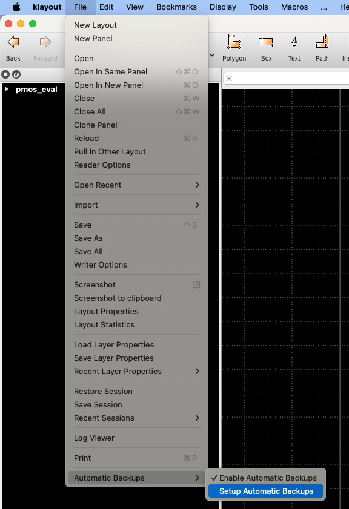
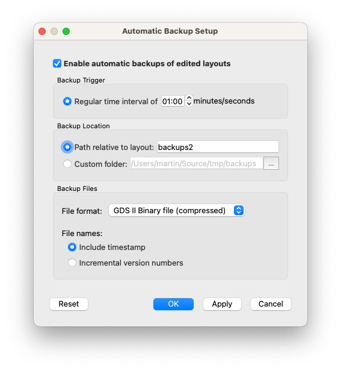

# KLayout Plugin: Automatic Backups

<!--

-->

* Periodically create backups
   * Save your precious layout work in case of crashes or power outages
   * Configure intervals and rotation scheme
   
This add-on can be installed through [KLayout](https://klayout.de) package manager, [see installation instructions here](#installation-instructions)

## Usage

### Tool activation and deactivation

Activate or deactivate the *Auto Backup* plugin by selecting *File*→*Automatic Backups*→*Enable Automatic Backups* in the main menu

Configure backup settings by clicking *File*→*Automatic Backups*→*Setup Automatic Backups* in the main menu

## Installation using KLayout Package Manager

1. From the main menu, click *Tools*→*Manage Packages* to open the package manager
2. Locate the `Automatic Backups`, double-click it to select for installation, then click *Apply*
3. Review and close the package installation report
4. Confirm macro execution
